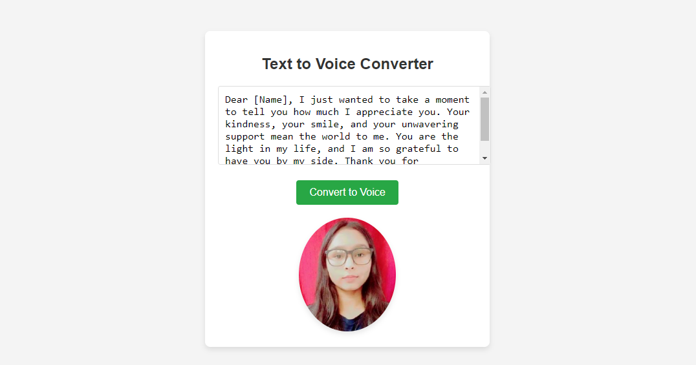

# Text to Voice Converter

This project is a simple and interactive web application that converts text to speech using the browser's SpeechSynthesis API. It features a clean and cozy design with animations and allows users to hear their typed text in a female voice.

## Features

- Converts text to speech
- Clean and responsive UI
- Supports female voice for text-to-speech
- Interactive image with a 3D rotation effect

## Installation

1. Clone the repository:
    ```sh
    git clone https://github.com/sanjukumari-tech/textToSpeechConverter.git
    ```
2. Navigate to the project directory:
    ```sh
    cd textToSpeechConverter
    ```
3. Open `index.html` in your preferred web browser.

## Usage

1. Enter your text into the textarea provided.
2. Click on the "Convert to Voice" button.
3. Listen to the spoken text in a female voice.

## Screenshots

### Main Interface


### Text to Voice Conversion


## License

This project is licensed under the MIT License. See the [LICENSE](LICENSE) file for details.

